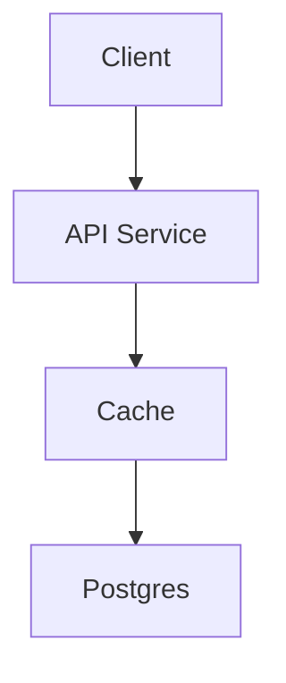

# Feature Flag Service

## 1. Summary
Production ready REST API service that stores feature flags, manages flag states globally and per-user, and evaluates feature availability for specific users while utilizing chaching for performance.

## 2. Goals
- Creation and storage of feature flags
- Managing flags globally or for a specific user
- Enpoint which evaluates if a flag is enabled for a given user
- Return proper HTTP status codes

## 3. Design

### 3.1 High-Level Arcitecture


### 3.2 Key Interfaces / Contracts
```
POST /v1/flag
Request:
{
    "user": string,
    "flagname": string,
    enabled: bool
}
Response:
{
    "flagname": string
}
```

```
GET /v1/flag
Request:
{
    "user": string,
    "flagname": string
}
Response:
{
    "flagname": string,
    "enabled": bool
}
```

```
GET /health
Response:
"healthy"

```go
type UserFlag struct {
    username string
    flagname string
    enabled bool
}
```

```go
type GlobalFlag struct {
    flagname string
    enabled bool
}
```

### 5.4 Data Flow / Sequence
TBD

### 5.5 Error Handling & Edge Cases
**Post /v1/flag**
HTTP 400 Invalid Flag Name
HTTP 409 Flag Exists

**Get /v1/flag**
HTTP 404 Flag Not Found

